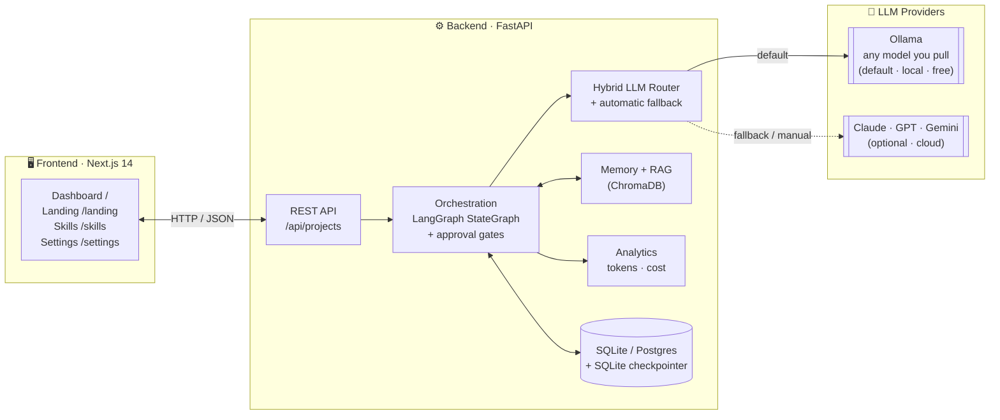
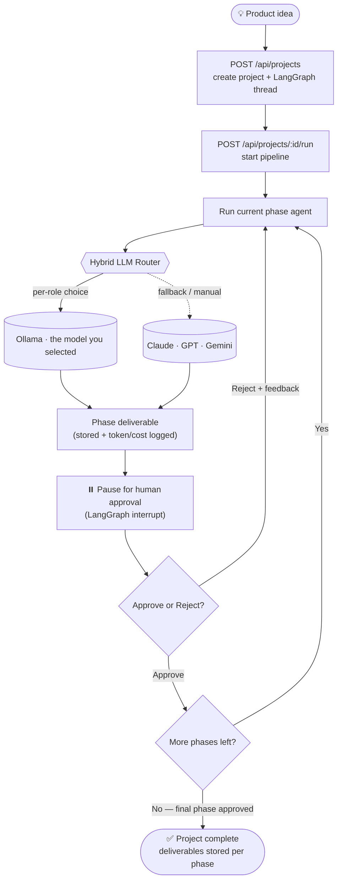
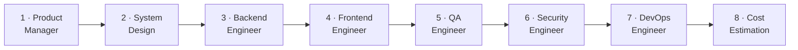

# AI Software Engineering Team

> A multi-agent AI platform that simulates a complete software engineering organization — turning a single product idea into production-ready software.

This repository contains the implementation of the platform described in
[`ai-software-engineering-team.md`](./ai-software-engineering-team.md).

Multiple specialized AI agents (Product Manager, System Design, Backend, Frontend, QA,
Security, DevOps, Cost) collaborate through a **LangGraph** pipeline with **human approval
gates**. It runs on **local models via Ollama** (default, zero cost) or **cloud LLMs**
(Claude, GPT, Gemini) through a hybrid router with automatic fallback.

---

## Architecture at a glance



```
frontend/   Next.js 14 + Tailwind + ShadCN-style UI
backend/    FastAPI service
  app/
    router/         Hybrid LLM routing & fallback (Ollama / Claude / GPT / Gemini)
    agents/         The 8 specialist agents
    orchestration/  LangGraph StateGraph + human-in-the-loop approvals
    memory/         Long-term project memory (ChromaDB)
    rag/            Knowledge base & retrieval (ChromaDB)
    skills/         The procedural library: loading, selection, injection
  skills/           The skills that ship with the platform (one folder each)
    analytics/      Token usage & cost tracking
    api/            REST endpoints
    db/             SQLAlchemy models (SQLite default, Postgres optional)
docs/       Architecture & agent documentation
```

The component folders map 1:1 to the spec's project structure; in this implementation the
Python packages live under `backend/app/` so they share one import root and one process.

---

## Quick start (local, zero cost)

### 1. Install Ollama and pull a model

```bash
# https://ollama.com/download
ollama pull qwen2.5:7b      # or any other model — Settings can pull and select one for you
ollama serve                # usually already running as a service
```

### 2. Backend

Requires **Python 3.9+** (Docker uses 3.12).

```bash
cd backend
python3 -m venv .venv && source .venv/bin/activate
pip install -r requirements.txt
cp ../.env.example .env       # tweak if you like; defaults work offline
uvicorn app.main:app --reload --port 8000
```

Open http://localhost:8000/docs for the interactive API.

Run the test suite (no Ollama needed — the LLM is stubbed):

```bash
pip install pytest
pytest -q
```

The tests exercise the full pipeline end-to-end: an 8-phase run through the
human-approval gates, the agent debate, reject/regenerate, auto-run mode, and analytics.

### 3. Frontend

```bash
cd frontend
npm install
npm run dev                   # http://localhost:3000
```

- **`/`** — the working dashboard (create a project, watch the live pipeline, approve phases).
- **`/landing`** — the marketing landing (Direction A · Blueprint): a full-bleed, self-contained
  React port of the Claude Design board, in `components/blueprint/` (state machine in `pipeline.ts`,
  styling in `blueprint.css`). The original Claude Design export is preserved under
  `design/claude-design-export/`.
- **`/settings`** — manage models at runtime (self-host): check / **download** the local Ollama
  model (live pull progress), and add your own **cloud API keys** (Claude / GPT / Gemini) without
  editing `.env`. Keys are stored on the backend only, in the gitignored
  `backend/data/providers.local.json`, and applied to the router immediately.

### Or with Docker

```bash
cp .env.example .env
docker compose up --build
```

---

## Using cloud models instead of / alongside Ollama

Set any of these in `.env` and the router will use them automatically in **Auto** mode,
or you can pick them explicitly in **Manual** mode:

```
ANTHROPIC_API_KEY=sk-ant-...
OPENAI_API_KEY=sk-...
GEMINI_API_KEY=...
```

If a cloud call fails (quota, network), the router falls back down a configurable chain,
ending at the local Ollama model so the pipeline keeps running.

---

## How much room a model gets, and what it must return

Pull whatever model you like — nothing about it is hardcoded. On first use the router
asks the model itself (`POST /api/show`) how large a window it was trained for, works
out how much of that the machine's RAM can actually hold as KV cache, and sends the
smaller of the two as `num_ctx` on every call. Settings → **Local runtime** shows the
resolved number, and so does the log:

```
Resolved model profile: ollama:<your model> — context 32,768 tokens (model limit 32,768,
source probe), output ≤ 4,096, schema-constrained decoding on
```

This is not a nicety. Without `num_ctx` a request over the server's default window is
truncated **from the head** — the system prompt, where the required output shape is
written, goes first — and the truncation is logged server-side where no client sees it.

Each agent declares its deliverable as a type (`app/schemas/agent_outputs.py`). That one
declaration becomes the JSON sketch in the prompt, the JSON Schema decoding is constrained
to, and the check the response is validated against. A response that misses gets one
repair round carrying the validation errors; if it still misses, the phase is flagged
rather than quietly stored — and the cost and security gates, which read specific keys off
these outputs, stop the run instead of reading nothing and calling it fine.

Every ceiling involved is yours to move: `OLLAMA_CONTEXT_CEILING`, `OLLAMA_RAM_FRACTION`,
`MAX_OUTPUT_TOKENS`, `SCHEMA_REPAIR_ROUNDS`. See `.env.example`.

---

## What the agents know before they start

Every agent used to begin a phase holding three things: the idea, the phases before it,
and whatever the knowledge base happened to retrieve. The *craft* — how to write an
acceptance criterion someone else can check, what a paginated endpoint sends back, which
OWASP categories matter for a form that takes card details — lived nowhere, and got
re-derived differently on every run by whichever model the router picked.

**Skills** are that missing layer. A skill is a `SKILL.md` with frontmatter, bound to the
agents it serves and the keywords that make it relevant:

```markdown
---
name: api-contract-design
title: API contract design
description: Use when defining HTTP endpoints, request/response shapes, status codes…
agents: [system_design, backend_engineer]
keywords: [api, rest, endpoint, http, pagination]
---

Name resources as plural nouns and act on them with methods…
```

Twelve ship in `backend/skills/`. Your own go in `backend/data/skills/` (gitignored,
beside `providers.local.json`), and one there shadows a bundled skill of the same name —
which is how the shipped library is editable without the repository being written to.
The `/skills` page does all of this without a text editor.

**Delivery is prompt injection, not tool-calling.** All four providers take the same
`list[ChatMessage]`, so a skill block is byte-identical on `qwen2.5:7b`, Claude, GPT and
Gemini. A 7B local model has no reliable tool loop, and building one per provider would
mean the local-only path — this project's default — got a worse team than the cloud path.

**Selection is a keyword score, decided before the call**, so a phase costs no more
latency than it did: drop what is switched off or excluded on this build, drop what is
not bound to the running phase, score the rest against the idea, the phase and what the
earlier phases wrote, pinned first. Two consequences are real and deliberate:

- **A keyword miss is silent.** The skill simply never arrives. That is what the
  per-build pin is for, and why `POST /api/skills/preview` — "which skills would this
  idea get?" — is on the `/skills` page and in the composer rather than being optional.
- **Everything selected is paid for, every phase.** There is no second level that loads
  on demand, so skills claim a share of the *same* prompt budget as RAG, memory and the
  prior phases (`_CONTEXT_SHARE` in `app/agents/base.py`) rather than a budget of their
  own. On a small window a skill arriving means RAG or memory gets less, which is the
  correct trade and a visible one.

That share is also the reason a skill can be selected and still not arrive: on a small
window carrying a lot of upstream source, the share can be smaller than the smallest
skill, and a procedure is injected whole or not at all — half of one is half of one. The
backend log says so by name when it happens, and the phase's review says it got none.

Two rules are enforced when a skill loads, not by review: a length ceiling (measured on
what is actually injected — the title and the description go into the prompt too), and no
instructions about output format — every agent already answers in a declared JSON shape,
and on a small model a prose "present this as a table" beats the schema and costs the
build a repair round. A skill that breaks either stays listed, with the reason, and is
never injected.

Which skills each phase actually received is recorded on its result and shown in the
review, because a skill you cannot confirm was used is indistinguishable from one that
did nothing.

---

## Workflow

A product idea flows through **8 specialist agents** in order. After each phase the graph
**pauses for human approval** — you can approve to advance, or reject with feedback to
regenerate that phase. Every agent call goes through the hybrid router, so a phase runs on
local Ollama by default and falls back to a cloud model only if configured/needed.



### The 8 phases



Each arrow is an approval gate. Agents also **debate** where their concerns overlap (e.g.
Security vs. Backend), and decisions are persisted to long-term memory for reuse.

### API in short

| Step | Call | What happens |
|------|------|--------------|
| 1 | `POST /api/projects` | Create a project + LangGraph thread from an idea |
| 2 | `POST /api/projects/{id}/run` | Start the pipeline (runs the next phase, then pauses) |
| 3 | `GET /api/projects/{id}` | Read the latest phase output |
| 4 | `POST /api/projects/{id}/approve` | Advance the graph to the next phase |
| 5 | `POST /api/projects/{id}/reject` | Send feedback → regenerate the current phase |

| Skills | Call | What happens |
|--------|------|--------------|
| List | `GET /api/skills` | The whole library, what each serves, and what is switched off |
| Add / edit | `POST` · `PUT /api/skills/{name}` | Save one to `data/skills/`; a bundled name is shadowed, never overwritten |
| Switch | `PUT /api/skills/{name}/enabled` | On or off for every build that does not name it |
| Remove | `DELETE /api/skills/{name}` | Deletes yours; on an edited bundled skill, restores the original |
| Preview | `POST /api/skills/preview` | Which skills each phase would get for an idea — before a run |

> Completion is **explicit**: the final phase must be approved (not merely reached) for the
> project to move to `completed`.

See [docs/ARCHITECTURE.md](./docs/ARCHITECTURE.md) for the full flow.

---

## Status

This is an iterative build. The backbone (router + Ollama, all 8 agents, LangGraph
orchestration with approvals, FastAPI, SQLite, memory/RAG/analytics, minimal UI) is in
place and runs end-to-end. See [docs/ROADMAP.md](./docs/ROADMAP.md) for what's next.
